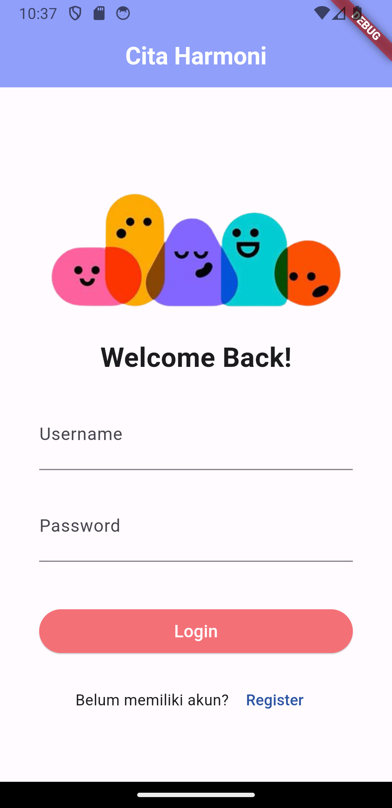
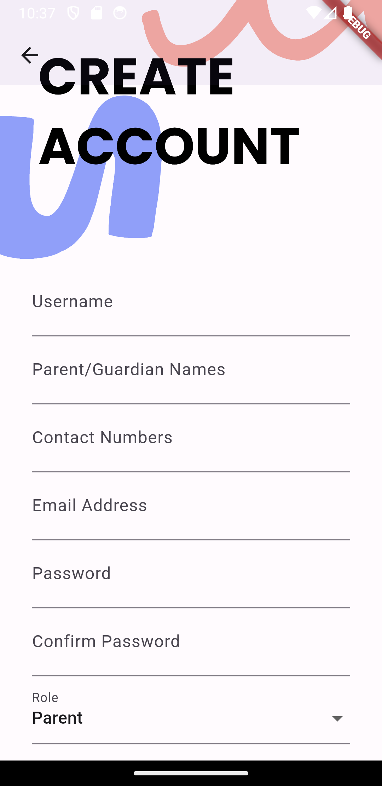
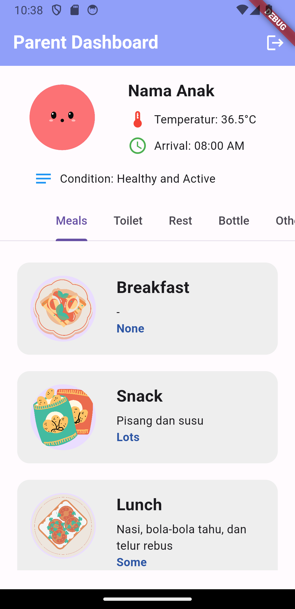
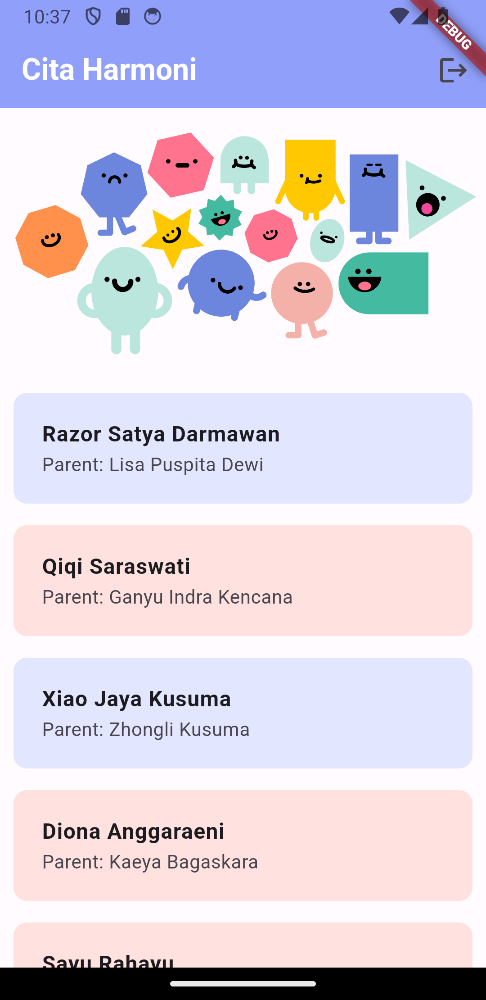
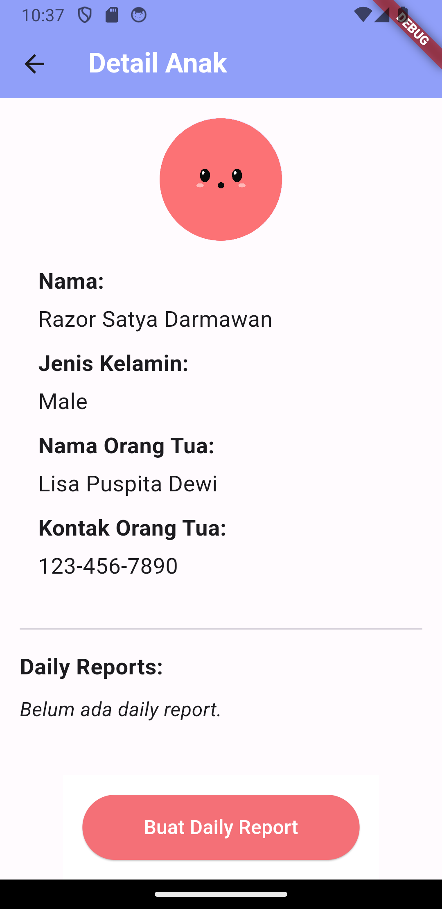
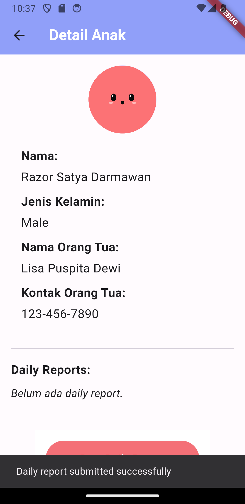
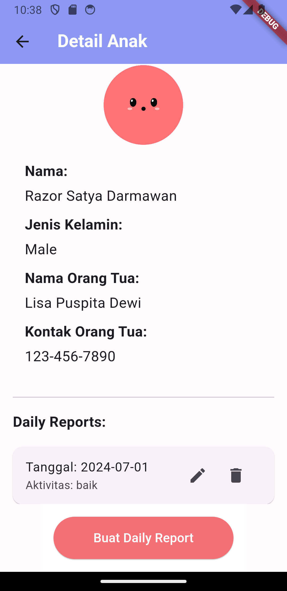
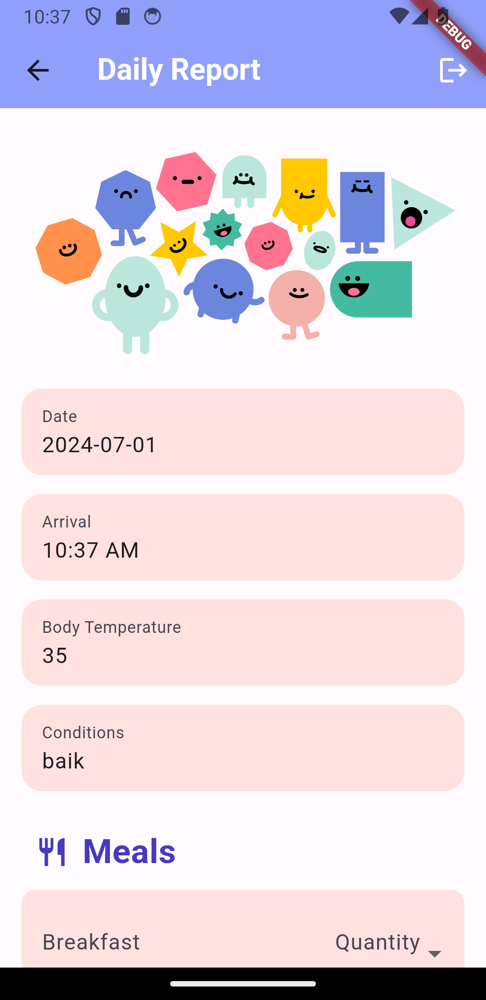

# Aplikasi Daycare Flutter

Aplikasi Daycare adalah aplikasi mobile yang dibangun menggunakan Flutter untuk memfasilitasi pengelolaan dan pemantauan kegiatan harian anak-anak di sebuah daycare. Aplikasi ini memungkinkan orangtua dan pengasuh untuk melacak aktivitas anak, membuat laporan harian, dan berinteraksi secara efisien.

## Fitur Utama

- **Halaman Login**: Pengguna dapat masuk ke aplikasi dengan akun mereka sesuai role mereka (pengasuh atau orangtua).

- **Halaman Registrasi**: Fitur untuk pengguna baru mendaftar ke dalam aplikasi.

- **Dashboard Orangtua**: Menampilkan informasi tentang anak-anak, laporan harian, dan detail aktivitas.

- **Dashboard Pengasuh**: Memungkinkan pengasuh untuk mengelola data anak, mencatat aktivitas harian, dan mengirim laporan.

- **Detail Anak**: Halaman yang menampilkan informasi rinci tentang setiap anak yang terdaftar.

| Form belum terisi          | Form terisi                 | Form sudah ada              |
|----------------------------|-----------------------------|-----------------------------|
|  |  |  |

Demo input form
[Klik untuk menonton video demo](images/demo_input_form.mp4)

Tonton video melalui goole drive:
[Link Google Drive](https://drive.google.com/file/d/1Z8UqsL3Dve3A0euiUxHDaUxtQV77QNuO/view?usp=sharing)

- **Form Daily Report**: Memungkinkan pengasuh untuk membuat dan mengirimkan laporan harian tentang aktivitas anak.

## Instalasi

1. Pastikan Anda memiliki Flutter SDK terinstal di komputer Anda.
2. Clone repositori ini ke lokal komputer Anda.
3. Buka proyek dalam editor kode favorit Anda.
4. Jalankan `flutter pub get` untuk menginstal semua dependensi yang diperlukan.
5. Hubungkan perangkat atau buka emulator Anda.
6. Jalankan aplikasi dengan perintah `flutter run`.

## Kontribusi

Kami sangat menghargai kontribusi dari siapa pun yang ingin meningkatkan proyek ini. Silakan buat `pull request` dengan perubahan yang diusulkan.

## Lisensi

Tuliskan lisensi proyek Anda di sini (misalnya MIT, BSD, dll).

---